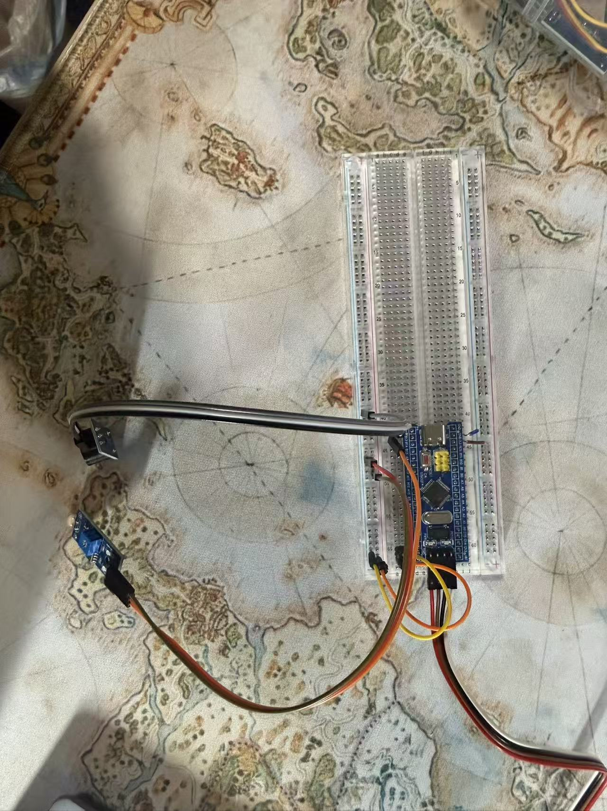

# NOTE for Photorisistor

## AO = Analog Output = ADC
- Can get brightness 

## DO = Digital Output = GPIO_INPUT
- Can judge light and shade

# STM32 Key Controlled LED

A simple STM32 GPIO project using an STM32F103C8T6 Blue Pill.


## Hardware

- STM32F103C8T6 Blue Pill
- Push button
- On-board LED


## Development Environment

- STM32CubeIDE
- STM32CubeMX
- STM32 HAL Library

## Demo
[Demo Video](media/demo.mp4)

## GPIO Configuration

### Hardware Setup



### Button

PB1 is configured as:

- GPIO Input
- Pull-up

The button is connected between PB1 and GND.

Therefore:

- Button released -> HIGH
- Button pressed -> LOW

### LED

The on-board LED is connected to PC13.

It is active-low:

- PC13 LOW -> LED ON
- PC13 HIGH -> LED OFF


## Main Logic
```c
	  if (HAL_GPIO_ReadPin (PHOTORESISTANCE_GPIO_Port, PHOTORESISTANCE_Pin) == GPIO_PIN_RESET)
	  {
		  HAL_GPIO_WritePin(BUZZER_GPIO_Port, BUZZER_Pin, GPIO_PIN_RESET);
	  }
	  else{
		  HAL_GPIO_WritePin(BUZZER_GPIO_Port, BUZZER_Pin, GPIO_PIN_SET);
	  }
```

