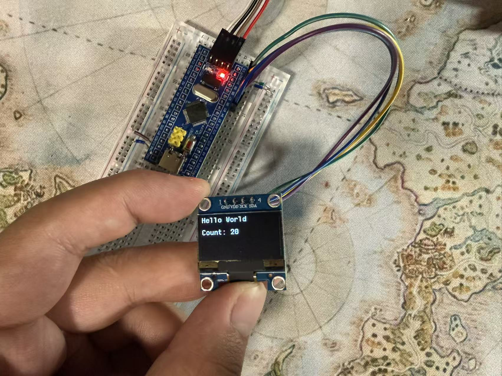

# STM32 SSD1306 OLED Counter

> A simple embedded project using an **STM32F103C8T6** to drive a **128×64 SSD1306 OLED display** through **I2C** and display a continuously increasing counter.

## Project Overview

This project was created to practise basic STM32 embedded development and OLED display control.

The STM32 communicates with an SSD1306 OLED using the HAL I2C interface.  
The OLED displays:

- A fixed `"Hello World"` message
- A continuously increasing counter
- The display is refreshed every 500 ms

Example:

```text
Hello World

Count: 123

## Hardware Setup


## Demo
[Demo Video](media/demo.mp4)

